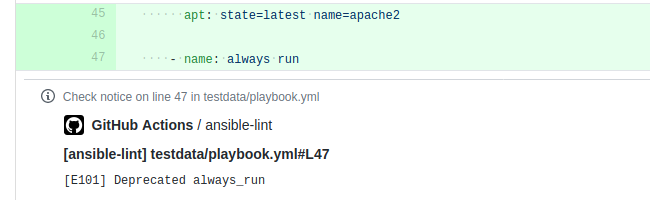
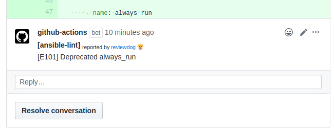

# GitHub Action: Run ansible-lint with reviewdog

<!-- TODO: replace barolab/action-ansible-lint with your repo name -->
[](https://github.com/barolab/action-ansible-lint/actions?query=workflow%3Atest)
[](https://github.com/barolab/action-ansible-lint/actions?query=workflow%3Areviewdog)
[](https://github.com/barolab/action-ansible-lint/actions?query=workflow%3Adepup)
[](https://github.com/barolab/action-ansible-lint/actions?query=workflow%3Arelease)
[](https://github.com/barolab/action-ansible-lint/releases)
[](https://github.com/haya14busa/action-bumpr)

This action runs [ansible-lint](https://github.com/ansible/ansible-lint) with
[reviewdog](https://github.com/reviewdog/reviewdog) on pull requests
to enforce best practices.

## Examples

### With `github-pr-check`

By default, with `reporter: github-pr-check` an annotation is added to
the line:



### With `github-pr-review`

With `reporter: github-pr-review` a comment is added to
the Pull Request Conversation:



## Inputs

### `github_token`

**Required**. Must be in form of `github_token: ${{ secrets.GITHUB_TOKEN }}`.

### `level`

Optional. Report level for reviewdog [`info`,`warning`,`error`].
It's same as `-level` flag of reviewdog.
The default is `error`.

### `reporter`

Optional. Reporter of reviewdog command [`github-pr-check`,`github-pr-review`].
The default is `github-pr-check`.

### `filter_mode`

Optional. Filtering for the reviewdog command [`added`,`diff_context`,`file`,`nofilter`].

The default is `added`.

See [reviewdog documentation for filter mode](https://github.com/reviewdog/reviewdog/tree/master#filter-mode) for details.

### `fail_on_error`

Optional. Exit code for reviewdog when errors are found [`true`,`false`].

The default is `false`.

See [reviewdog documentation for exit codes](https://github.com/reviewdog/reviewdog/tree/master#exit-codes) for details.

### `targets`

**Required**. Paths to ansible files (i.e., playbooks, tasks, handlers etc..) or valid Ansible directories according
to the Ansible role directory structure.

### `args`

Optional. Arguments to be passed to the ansible-lint (verbosity & parsable options not supported here)

```bash
Options:
        -r RULESDIR           specify one or more rules directories using one or
                              more -r arguments. Any -r flags override the default
                              rules in ansiblelint/rules, unless -R is also used.
        -R                    Use default rules in ansiblelint/rules in addition to
                              any extra
                              rules directories specified with -r. There is no need
                              to specify this if no -r flags are used
        -t TAGS               only check rules whose id/tags match these values
        -x SKIP_LIST          only check rules whose id/tags do not match these
                              values
        --exclude=EXCLUDE_PATHS
                              path to directories or files to skip. This option is
                              repeatable.
        -c C                  Specify configuration file to use. Defaults to ".ansible-lint"
```

### `override_deps`

Optional. Allows pinning pip packages and there versions. This allows to pin to a target package version in order to maintain consistency with local development.

## Outputs

## `ansible-lint-return-code`

The `ansible-lint` command return code.

## `reviewdog-return-code`

The `reviewdog` command return code.

## Usage
<!-- TODO: update. replace `template` with the linter name -->

```yml
name: reviewdog
on: [pull_request]
jobs:
  ansible-lint:
    name: runner / ansible-lint
    runs-on: ubuntu-latest

    steps:
      - name: Clone repo
        uses: actions/checkout@v2


      # Minimal example
      - name: ansible-lint
        uses: barolab/action-ansible-lint@master
        with:
          github_token: ${{ secrets.github_token }}
          targets: ./**/*.yml

      # More complex example
      - name: ansible-lint
        uses: barolab/action-ansible-lint@master
        with:
          github_token: ${{ secrets.github_token }}
          reporter: github-pr-review # Optional. Change reporter
          fail_on_error: "true" # Optional. Fail action if errors are found
          filter_mode: "nofilter" # Optional. Check all files, not just the diff
          targets: | # Required. The files to lint
            ./testdata/**/*.yml
            ./testdata/**/*.yaml
          args: "-x 301" # Optional. Add custom ansible-lint arguments
          override-deps: | # Optional. Pin pip packages versions
            ansible~=2.9
            ansible-lint~=4.1
```

## Development

### Release

#### [haya14busa/action-bumpr](https://github.com/haya14busa/action-bumpr)

You can bump version on merging Pull Requests with specific labels (bump:major,bump:minor,bump:patch).
Pushing tag manually by yourself also work.

#### [haya14busa/action-update-semver](https://github.com/haya14busa/action-update-semver)

This action updates major/minor release tags on a tag push. e.g. Update v1 and v1.2 tag when released v1.2.3.
ref: https://help.github.com/en/articles/about-actions#versioning-your-action

### Lint - reviewdog integration

This reviewdog action template itself is integrated with reviewdog to run lints
which is useful for Docker container based actions.


Supported linters:

- [reviewdog/action-shellcheck](https://github.com/reviewdog/action-shellcheck)
- [reviewdog/action-hadolint](https://github.com/reviewdog/action-hadolint)
- [reviewdog/action-misspell](https://github.com/reviewdog/action-misspell)

### Dependencies Update Automation

This repository uses [haya14busa/action-depup](https://github.com/haya14busa/action-depup) to update
reviewdog version.

[](https://github.com/barolab/action-ansible-lint/pull/6)
